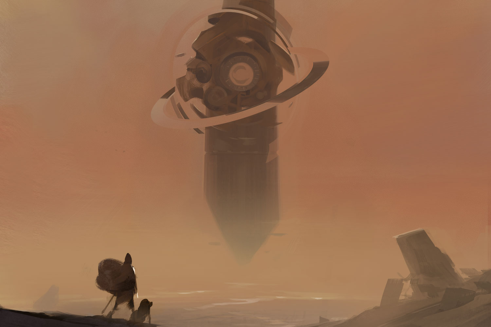

>The Catechism of Lore: 
>All glory to the originators of truth and understanding.
>Praise to the innovators of steel and synth.
>Praise to the shapers of flesh, of bone, and of mind.
>Glory to those who re-sculpted the sustaining earth and the life-giving sun.
>Praise to the senders of signals, who even now whisper into machine ears and give life to the inanimate.
>Praise to those who traveled to the stars, and the realms beyond the stars.
>All glory to the originators of truth and understanding.
>Let us then resume the recitation of the Sacred Chronicle of High Father Calaval, Amber Pope and Founder of the
>Citadel of the Conduit and the Order of Truth, as written by his grandniece, Doroa of the Silent Song:

## CHAPTER IX: WIND OF IRON
_In which we learn the lesson of dedication._

Calaval climbed the hill, his pet thuman at his side. Crumbling bits of ancient brick turned to gravel with each step. At the top, he saw the amber obelisk the old woman had told him about. It stretched impossibly into the sky. The reddish-yellow light of the old, tired sun caught in its angles high above the plain of ruin. Even after all these eons, the machine at the heart of the obelisk still thrummed with power. Rings orbited the device, spinning with unearthly precision.

The Thuman sat on its haunches, multi-jointed legs folding beneath it. It looked up at its master with narrow, black eyes. Red dust covered the furry crest atop its head. 

Calaval set his heavy pack down next to him, exhausted. He bent down and brushed the dirt and dust away from it, and then from his clothes. Finally, he brushed the red dust from the thuman. “Don’t worry, Feddik,” he whispered. “You won’t have to go inside. I’ll have to do that alone.” Feddik’s gaze, as always, made it seem as though he understood. 

After a short rest, the pair resumed their journey. The people in the last village, Cloudridge, had called this the Plain of Brick. The lack of creativity did not surprise Calaval. A simple folk without a clave, they toiled in fields and herded shereh in the fertile valley to the south. But they’d given him food in exchange for a few baubles and shins he carried with him, and gave him a place to sleep, so it was difficult to feel anything but kindly toward them. Isolated villages with Aeon Priests often became fearful of strangers and dangerously insular. Once, he had come upon a community that had stumbled upon a buried facility from the prior worlds while digging a well. They had inadvertently released a noxious gas, transforming the entire population into maniacal, superhuman cannibals. Calaval had barely escaped alive. 

Aeon Priests and their knowledge of numenera could prevent incidents like that. Calaval sought to join their ranks. 

History taught that the ancient species that had dwelled upon earth before the Ninth World wielded great power. This power came from knowledge. It might not be possible for Calaval, the Aeon Priests, or anyone else on earth of the present to master all that knowledge, but surely there were secrets there, lost to the past, upon which they could build a future. 

Calaval was certain of it. It just had to be discovered. Or rather, rediscovered. He had a plan on how to start. A red cloud rose on the horizon, beyond the obelisk in the sky. Someone moving across the dry plain? Certainly something big if that was the case. Perhaps a herd. Perhaps a pack of raiders. 

Feddik whined. The cloud loomed larger. No herd. No creature at all—a dust storm. 

Calaval unpacked his desert filter and put it over his mouth. Then he fitted one over Feddik’s nose and mouth. The beast pawed at it a few times, but accepted it quickly. They had been through dust storms together before. 

The barren plain offered little shelter. Calaval kept walking, for there were few other options. The thuman stayed very close. The wall of onrushing red engulfed the obelisk and bore down upon the explorers like a monster. Through his filter, a scent caught the young man’s attention. It jogged a memory. It triggered fear. 

“Iron wind!” 

Calaval looked around helplessly for some kind of shelter. But there was nowhere to hide. Not from the wind. He would stand against the ravages of a sandstorm, even as it tore at his flesh, but the iron wind was something different altogether. It didn’t just tear at flesh, it altered it. Within the wind lived particles crafted by the numenera far too tiny for a man to see. Calaval wasn’t actually certain that “particles” was the right word. Creatures? Machines? It surpassed understanding. 

His pack thudded on the ground. He rummaged through its contents while the thuman whined. Finally, he produced a small iron awl and a device that looked like it was meant to fit snugly in a person’s clenched fist, if a person had six fingers. In two places across its synth surface small wires lay exposed. Calaval crouched low. 

A small glass panel on one side showed lighted symbols when he pressed a small stud where his thumb would fit. He didn’t know what the symbols meant, but he knew that when a symbol that reminded him a bit of a bird in flight flashed, he needed to press the stud again. He glanced up and saw the roiling red cloud approach. Ignoring the sweat beading at the bridge of his nose, Calaval pushed the awl up into the cavity among the exposed wires near the bottom. The device shook a bit and there was a sizzling sound and the smell of burnt air. Suddenly, a droning noise engulfed Calaval and the nerves all along his flesh tingled unpleasantly. The awl slipped from his hand. 

He clenched the device and pulled Feddik close. The thuman squirmed as the air around them shimmered. The hair on Calaval’s arms rose and his skin prickled. The shimmering air smelled like a thunderstorm. He knew that it was a sort of halo around him. An aura. A field. He did not know, but he hoped, that the field would repel the dangerous, unseen things in the iron wind. 

The approaching numenera storm did not offer him much time to wonder if it would work. The air was suddenly red, churning. The generator in his hand vibrated at a terrible frequency. It numbed his hand and then his arm. He concentrated on holding fast to it even though he could no longer feel it. He told himself that the billions of tiny shrieks in the wind were but his imagination. 

The iron wind roiled around him, but it did not harm him. 

With a whine that quickly became a howl, Feddik twisted from his grasp, pulling away. Calaval shouted without sound. The beast’s leftmost limbs and side emerged from the shimmering distortion and entered the wind. Calaval could not see what happened, nor could he still hear his companion. The thuman’s body thrashed. Calaval grabbed a handful of Feddik’s hair and held on as best he could while the device in his other hand numbed more and more of his body, weakening every muscle he had. 

He closed his eyes. 

The wind passed more quickly than any sandstorm would, but none too quickly for Calaval. The device dropped from his contorted, numb fist onto the stony ground. He collapsed, but was careful to pull Feddik atop him, rather than to fall upon the beast. 

Feddik made a plaintive moan unlike anything Calaval had ever heard. 

When he could manage it, Calaval lifted his head to look at his pet. Hundreds of tiny, wormlike tendrils flailed where Feddik’s left two limbs had once been. The flesh around those legs, and all along the left side, looked and felt like metallic plates. Orifices that Calaval could not begin to understand erupted and closed on the beast’s new portions. The left side of its face contorted with opening and closing eyes as if a crowd of smaller creatures had taken up residence in its head. 

The wind had rewritten the thuman. Every bit of its flesh that the wind had touched, it changed. 

Calaval pushed Feddik from atop him and stood. His stance was not steady, but he hardly noticed. He looked only at his longtime companion slowly writhing on the ground. Pain was evident in every fiber of the creature, new and old. 

With a wail, Calaval drew the long knife at his side from its leather sheath. 

He held his breath. Tears streamed down his face. He wanted to close his eyes, but he feared his aim would fail. So he stared down at Feddik. He watched his friend’s eyes as he sliced into the nonmetallic part of its neck. Blood pooled around the creature. It died in silence. 

Calaval did not curse the gods his mother had taught him, nor did he pray to them for mercy. It wasn’t that he did not believe in vast, nonhuman intelligences living in the sky above—he had seen them orbiting in Yessai’s telescope night after night—he just did not believe that they directed events. He believed in cause and effect. Not gods. Even the things inhabiting the datasphere were created, the result of someone’s knowledge and understanding. He believed in the universe and its laws, set in motion billions of years earlier. 

Just because the people of this world called it magic did not mean that he could not see beyond. That was what the Aeon Priests did, and—as hard as it was to accept—that is what he would do too. The numenera, as the priests called it, arose because of the intellect of the people of the prior worlds. It only seemed like miracles. 

It only seemed like damnation.

## CHAPTER X: ALONE
_In which we learn the lesson of loss._

Alas, Chapter X is lost to us. It is believed by the council that it contained details of Calaval’s mourning of his animal, and thus described his compassion and capacity for love. Likely it also detailed his fantastic intelligence (particularly his near-perfect recall) and his great wisdom, often being well prepared for contingencies that most others would never have foreseen. 

Instead of its contents enriching us, let us contemplate on the significance of lost knowledge. No greater loss exists. 

All glory to the originators of truth and understanding.

## CHAPTER XI: ENTERING THE OBELISK
_In which we learn the lesson of perseverance._

The Amber Monolith rose high above Calaval. Almost directly below the obelisk machine, the noise that the vast spinning mechanism produced drowned out the sounds of his own weary breath. The rotating rings moved and thrummed in a rhythm that heartened him. It was exactly what he was looking for. The old woman in Cloudridge had told the truth. 

Calaval had only one last trick in his bag. The rest of its contents were mundane supplies, tools, and equipment. But he had saved one minor bit of numenera for just this moment. He pulled a wire mesh belt from the bag and affixed it around his waist. A metal device on the side of8 the belt had some simple controls. Sometimes bits of technology like this—cyphers, most people called them— seemed like they were once parts of other, larger devices. Those who had come before him had just figured out a way to make use of them in a temporary, usually one-shot, damn-the-risks sort of way. Calaval knew a lot of the tricks. He didn’t fully understand how they worked. No one he knew did. But he knew enough to try that switch, or cross those wires, or look for a readout with this symbol on it. Enough to sometimes get an effect he wanted. Something he could use. Like now. 

Except the belt wasn’t like that. The belt, Calaval felt sure, was intended for precisely the purpose for which he was about to use it. The only thing was the way it fit him. Obviously, it had been designed for a creature other than a human to wear it. 

Calaval manipulated the controls. Soundlessly, his feet left the ground. Buoyant, he floated upward. The belt gently removed him from the grasp of gravity. He soared ever higher. The red brick landscape stretched below him. A warm wind tugged at his tanned leather clothing—his coat, his cap. It brushed against his worn, unshaven face. 

Above him, the Amber Monolith drew closer, and he could see that, true to its name, the yellowish-brown structure offered a translucent surface in contrast to the silvery metallic mechanism at its heart. The obelisk offered a pointed top and bottom, but the center was a massive clockwork device with spinning rings orbiting around it at skewed but somehow extraordinarily precise angles. 

As he got very close—likely hundreds of feet above the ground—the very lowest point of the hovering obelisk offered a metallic hatch to Calaval. Controlling his horizontal position presented some difficulties. Once again, the position of the belt’s console suggested a wearer with a very different body type than his. His arm grew sore from reaching down and around to touch the tiny, glowing panels. The wind made things even harder. Calaval maneuvered toward the hatch, but then the breeze carried him off in the wrong direction again. The situation suggested how hard it might be to be a leaf in the breeze with an objective. Or even a butterfly. Calaval fumbled across the belt controls over and over, grasping at the hatch as he got close each time, and each time failing to reach it. 

He began to worry about just how much power the belt had. How long a duration the gravity-nullifying effect offered. 

His arms sore, each from stretching in different directions, in different awkward positions, he tried one last time, and finally maneuvered close enough to loop his arm through a handle on the hatch like a hook. The incoherent sound he made was a moan of exasperation and a cry of triumph at once. 

Then the power of the belt gave out. 

His own sudden weight jerked on his arm, wrenching it with a painful cracking noise. Agony shot down his shoulder and into his side. He grabbed his wrist with his free hand to make it harder for him to slip loose, but he almost blacked out from the pain. 

Dangling from the bottom of the obelisk, he gasped for a breath he could not seem to get. His mind swam and he had to fight to keep a focus. Finally, because if he did not, he knew he would soon faint and fall, he let go of his own wrist and thrashed at the hatch to try to find a way to open it. 

That task, at least, was surprisingly simple. An easily moved lever produced a sudden hiss, and then the hatch opened slowly. Calaval struggled to hang on to the moving hatch. When it stopped, he twisted his body around to look up into the opening it gave. It was dark, but a metallic ladder offered a way up through an amber shaft. With his free hand, he grabbed the bottom rung, but as he did his other arm wrenched free. 

Again, terrific pain lanced down his body from shoulder to hip. He bit down on his tongue, which may have been the only thing that kept him conscious. His one arm dangled, useless. He had no idea how he would climb up the ladder. 

He did the only thing he could think of, and pulled himself up as high as he could and kicked his leg up to hook it onto a rung. After a few tries, he succeeded. But when he did, his pack came loose and spilled its contents down the long way to the ground. 

Thoughts of gods to curse once again came to his mind. Once again, he refused.

## CHAPTER XII: HUNTED IN THE DARK
_In which we learn the lesson of ingenuity._

The climb was long and agonizing. Every surface around Calaval vibrated slightly with a constant thrum that kept time with the spinning rings of the central heart of the monolith. Even the air seemed to shake, ever so slightly. Exactly the rhythm he had memorized. The one he had been looking for. 

The top of the amber shaft offered light too dim to see, and Calaval had lost his glowglobes when his pack fell. With his good hand, he pulled a box of matches from his pocket and struck one. He confirmed that his immediate surroundings were safe, and then tossed the match away, collapsing on his side for an unknown time. He knew he had to push his arm back into its proper position. When he was a young man, he had seen his farmer father in a similar situation. He had had to help the man reset his shoulder. 

Today Calaval would have to do it himself. He struggled to his feet. The pain made his head swim and he almost fell. He felt the wall in the dim amber-hued light. He positioned his dislocated limb with his useful arm. He took three quick breaths. Not giving himself time to think about it, he rammed his body against the wall. 

He shrieked and fell to the floor, writhing in agony. 

He shrieked louder the second time. He passed out for a time—he did not know for how long—after realizing that that attempt didn’t succeed either. 

The third attempt had a similar result. 

Finally, the fourth try gave him success. He did not pass out, but lay, resting in his own sweat, for what seemed about an hour. Once he recovered, he climbed once again to his feet. He stood steadier than before. With three deep breaths, he gathered himself mentally and physically. At last, he decided to explore. 

He had come here for a reason, after all. 

He found himself within a series of tunnels wending their way through vast, incomprehensible machines. Or perhaps, he considered, parts of one large machine. The latter, he determined, seemed most likely. 

After burning through half his matches in his explorations, he found a pile of scrap synth in various sizes and colors. Mostly pipes, some of which were hollow, and others filled with cables and wires. Some were broken and jagged. Calaval found a hollow pipe of white synth about two feet long. He used his knife to cut his leather cap into strips. Poking a strip down into the pipe, he created a makeshift torch. It wouldn’t last long, and it created a lot of smoke, but it would last longer than a match, and he had many strips of leather and cloth to use. 

He climbed another shaft, and after wandering more, yet another. During each ascent his torch failed him and he had to relight it in the dim light once he reached the top. By the time he did this after the third climb, a loud staccato burst of sound startled him. He dropped the torch and the barely lit leather strip fell out. 

The strange, irregular noise accompanied a flash of bluewhite illumination. And again. 

In these brief instances of light, he saw something move. A panel in one wall opened. More light from within. With a yawning hiss, a silhouette emerged. Clatter. Whir. Groan. Ancient limbs stretched to life. Metal, flesh, and wiring shambled in the form of a looming ape. Shaggy hair fluttered about it, as if each strand had its own prehensile life. White eyes glared from above a wide snout, symbols scrolling across them from side to side. 

Calaval did not wait to see more. He leapt down the shaft, throwing himself from rung to rung, letting gravity take him at speed. His shoulder was still tender, but he ignored it. 

A howl from above shook his bones. A dark shape blotted out the light from above. He climbed down faster. Recklessly, he dropped down the shaft. Each drop risked pulling his arm from its socket, but terror ruled his behavior, not pain. 

At the bottom of the shaft, he retraced his path through the winding maze of machine access conduits. He heard the thing land at the bottom behind him with a powerful grunt. He was sure that he could smell the beast too. Musk and machine oil mixed with something he couldn’t place. 

In the near darkness, he surged down the corridors, running a hand along the walls. The guardian thing that he had awoken was behind him, tracking him. By sound, perhaps? Calaval tried to be as quiet as he could, but soon gave up and erred on the side of speed. The thing could be following him by scent. It could even be following a heat trail of his own steps. He knew such things were possible. 

Finally, he reached the pile of scrap tubing. The pipes, however, once he grasped a few, seemed far too light to be used as weapons. Instead, he grabbed one about his height and got moving again. 

The bestial thing lumbered ever closer. 

Calaval reached the shaft down and dropped the tube. Then he followed it down, again performing more of a barely controlled drop than a climbing descent. 

The creature came down behind him. Closer this time, and gaining. Like Calaval, it was dropping down, using the rungs only occasionally. But its drops were longer, its movements more skilled. 

Calaval reached the bottom of the shaft, but knew that the thing would reach him this time. 

In fact, he counted on it. 

He grasped the jagged length of synth tubing and thrust it up the shaft, one end braced against the floor. 

Immediately, the beast dropped down upon the tube, its weight snapping it in two and knocking Calaval to the ground. Calaval’s head struck the wall. He saw white in the darkness. He found himself lying on the tremulous metal floor, unable to see. The sound of his own breaths was drowned out by another sound—rhythmic, wet, gurgling wheezes from not far away. 

Calaval struck a match. In the light, he saw the ape-thing, with metal plates and fleshy parts integrated into a cobbled whole. There was nothing beautiful, careful, or elegant about the thing’s construction. Even its organic portions did not seem to exist in any sort of natural relationship. Hairlike tendrils writhed across its body, each ending in a tiny sphincter mouth. And each tiny mouth whined in agony. 

Through the center of its broad torso projected the broken tube. The momentum of the creature’s descent had thrust the shaft more than three feet into its innards. The beast did not move. Each breath was labored and filled with fluid. Blood mixed with some white milky liquids pooled around its prone body. 

Calaval’s fear turned to remorse. Pity. He thought that the best thing he could do was bring the beast’s suffering to an end. He wanted to give it a quick death. 

He had no idea how to do that. His small knife, now in his hand, seemed ridiculously tiny and fragile for the task. He approached closer in the light of a new match, but the creature howled and struggled to move, causing it far more pain. 

Calaval sighed. His thoughts drifted back to Feddik. 

He sat on the floor. He stayed with the creature until it drew its last labored breath.

## CHAPTER XIII: MACHINE’S HEART
_In which we learn the lesson of comprehension and understanding._

In the mechanical parts of the dead guardian, Calaval had found some easily removed bits that, with some slight modifications and adaptations, he could use. If he hadn’t dropped most of his tools with the rest of his gear, he perhaps could have achieved more. 

Perhaps most important of them all were the glowing modules in the creature’s eyes that, once removed, provided about as much light as his tiny torch. He knew that their illumination would fade, but in terms of his own needs, it would be long after it ceased being important. 

With these new cyphers, he ascended back up through the obelisk’s inner workings. He crept slowly now. Quietly. 

No more guardians appeared. 

He stopped to rest, and regretted having no food. 

He slept.

Steadily, he climbed the length of the massive monolith, until the quivering in every surface reached a powerful intensity. Reaching the top of the twenty-third shaft he had climbed, he determined that he had found the heart of the machine. At that level, he began to explore in earnest, carefully noting everything he found. 

The glowing cylinder stretched twenty feet across, thirty feet high. Made of blue metal, it gave off a bluewhite glow. It floated two feet from the ground and hovered two feet from the high ceiling. Nothing connected to it from all the machinery around it, but Calaval knew that it was connected by invisible fields of energy and force. 

He wiped the sweat from his brow. The interior of the monolith was warm and humid. The air was stale. Stifling. He needed to get inside that cylinder. 

He studied its surface for hours, looking for an access panel or a hidden hatch. He found nothing. 

He slept again. Fitfully. 

He searched the walls of the large chamber around the cylinder. He studied them for mechanisms that might open or provide access into it. Finally, he returned to the cylinder and scoured its vibrating, glowing surface again. At long last, he determined that there was a panel in its surface—a door—almost impossible to perceive. But there was no obvious way to open it. 

Driven by this new discovery, he returned to the machinefilled perimeter of the room. He followed lines of conduits that ran across their surfaces, up to the ceiling and down to the floor. He ascertained that the controls of some important function lay behind a large metal panel, but when he tried to pry it off with his knife, its iron blade snapped. 

He sat down on the floor, tired and hungry. 

“Of course,” he said aloud. He pulled out one of the components he had removed from the guardian creature. A weapon had been built into one of its arms, and he could coax its power for a different use of his own. Sliding open a tiny panel at one end of the device, he moved a tiny switch while pointing it at the panel. He saw nothing, but felt the fist-sized thing almost buck out of his hand. He thrust it toward the panel, which buckled with a loud bang and folded like paper. Guiding it with the device as though it was an invisible fist, he pulled back and the panel tore from its mountings. 

Calaval tossed the device to the floor next to it with satisfaction. 

The newly exposed glass plate flared to life and light, showing symbols and diagrams. Calaval recognized almost nothing, but after a few tries, touching the screen and moving the symbols as though they were objects rather than bits of light, he quickly figured out how to activate the cylinder’s door. 

Turning to face it, he watched as the square section of the machine’s heart simply faded from sight. 

This revealed an empty but brightly lit interior. 

Without hesitation, Calaval entered the cylinder. 

And then stood elsewhere. 

Without realization of transition or translation, Calaval had moved vast distances. As he had hoped. Long ago he had learned of this place. 

High above him stretched a transparent dome. Through it, he looked up at the world, displayed before him as the center jewel of a vast night-sky panorama. Or rather, he reasoned, he looked down at the world. For he knew that he was in a citadel created in eons past by inhuman hands and placed high above, permanently in the sky. 

Legends spoke of a citadel in the sky so high that it was barely visible from the ground. Calaval had seen it in Yessai’s telescope. And the old woman in Cloudridge had given him the secret of how to access it. 

Here, Calaval knew, were the true secrets of the numenera. Here he could perhaps—just perhaps—speak with one of the vast intelligences given life in the prior worlds. If he could make his questions understood, he could find the knowledge he sought to join the Aeon Priesthood, and perhaps even become a prominent member of their ranks. 

Thus ends the second part of the Sacred Chronicle of the Amber Papacy. Little did Calaval know that the knowledge he would gain would make him not an Aeon Priest, but greatest among them: the high father, greatest of the Aeon Priests, and founder of the Order of Truth.

>All glory to the originators of truth and understanding.
>Praise to the innovators of steel and synth.
>Praise to the shapers of flesh, of bone, and of mind.
>Glory to those who re-sculpted the sustaining earth and the life-giving sun.
>Praise to the senders of signals, who even now whisper into machine ears and give life to the inanimate.
>Praise to those who traveled to the stars, and the realms beyond the stars.
>All glory to the originators of truth and understanding.