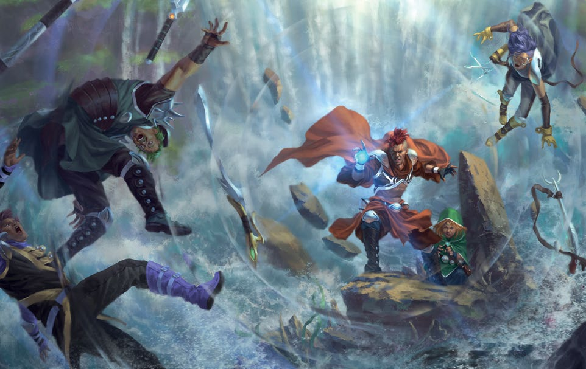

Making an attack in combat works the same way as any other roll: the GM assigns a difficulty to the task, and you roll a d20 against the associated target number.

The difficulty of your attack roll depends on how powerful your opponent is. Just as tasks have a difficulty from 1 to 10, creatures have a level from 1 to 10. Most of the time, the difficulty of your attack roll is the same as the creature’s level. For example, if you attack a level 2 bandit, it’s a level 2 task, so your target number is 6. 

It’s worth noting that players make all die rolls. If a character attacks a creature, the player makes an attack roll. If a creature attacks a character, the player makes a defense roll. 

The damage dealt by an attack is not determined by a roll—it’s a flat number based on the weapon or attack used. For example, a spear always does 4 points of damage.

Your Armor characteristic reduces the damage you take from attacks directed at you. You get Armor from wearing physical armor (such as a sturdy leather jerkin or chainmail) or from special abilities. Like weapon damage, Armor is a flat number, not a roll. If you’re attacked, subtract your Armor from the damage you take. For example, a leather jerkin gives you 1 point of Armor, meaning that you take 1 less point of damage from attacks. If a bandit hits you with a knife for 2 points of damage while you’re wearing a leather jerkin, you take only 1 point of damage. If your Armor reduces the damage from an attack to 0, you take no damage from that attack.

When you see the word “Armor” capitalized in the game rules (other than as the name of a special ability), it refers to your Armor characteristic—the number you subtract from incoming damage. When you see the word “armor” with a lowercase “a,” it refers to any physical armor you might wear. Typical physical weapons come in three categories: light, medium, and heavy. 

**LIGHT WEAPONS** inflict only 2 points of damage, but they ease attack rolls by one step because they are fast and easy to use. Light weapons are punches, kicks, clubs, knives, handaxes, rapiers, and so on. Weapons that are particularly small are light weapons.

**MEDIUM WEAPONS** inflict 4 points of damage. Medium weapons include swords, battleaxes, maces, crossbows, spears, and so on. Most weapons are medium. Anything that could be used in one hand (even if it’s often used in two hands, such as a quarterstaff or spear) is a medium weapon.

**HEAVY WEAPONS** inflict 6 points of damage, and you must use two hands to attack with them. Heavy weapons are huge swords, great hammers, massive axes, halberds, heavy crossbows, and so on. Anything that must be used in two hands is a heavy weapon.

Rarely, an ability or piece of equipment does not ease a task’s difficulty but instead adds a bonus to the die roll. Bonuses always add together, so if you get a +1 bonus from two different sources, you have a +2 bonus. If you get enough bonuses to add up to a +3 bonus for a task, treat it as an asset: instead of adding the bonus to your roll, you ease the task. Therefore, you never add more than +1 or +2 to a die roll. 

	Although the Ninth World has many 
	quasihistorical weapons and armor 
	like swords, spears, and chainmail, 
	it also has unique items like razor 
	rings, which are bladed	metal 
	throwing weapons.